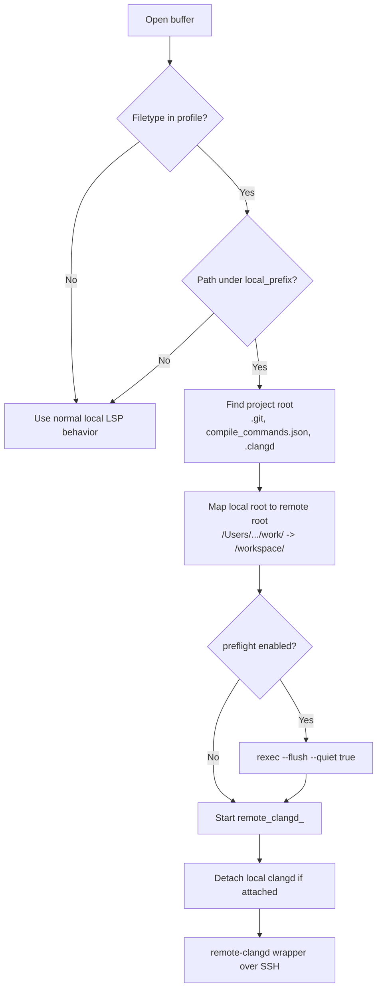
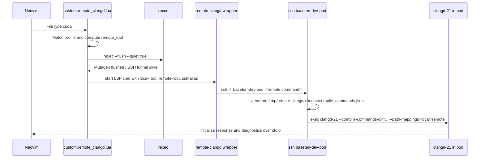
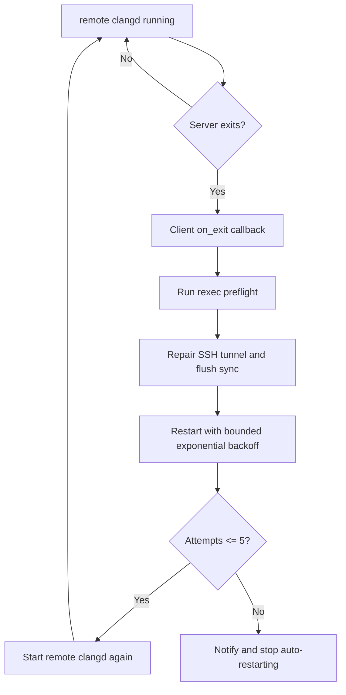

# Remote clangd for CUDA

This documents the personal Neovim workflow for editing CUDA locally while
receiving diagnostics from a remote B200 Kubernetes dev pod.

The problem this solves: local macOS `clangd` cannot accurately impersonate the
remote NVIDIA CUDA/B200 environment. For example, local `clangd` falls back to
`sm_52` and reports setup errors such as `Cannot find CUDA installation` and
`Cannot find libdevice`. Instead, Neovim starts `clangd-21` inside the synced
B200 pod and maps local paths to remote paths.

## Components

| Component | Location | Purpose |
| --- | --- | --- |
| Neovim module | `~/.config/nvim/lua/custom/remote_clangd.lua` | Detects matching C/C++/CUDA buffers, blocks local `clangd`, starts remote clangd. |
| Project profiles | `~/.config/nvim/lua/custom/remote_clangd_projects.lua` | Private local-to-remote mapping, toolchain, and compilation database config. |
| Stdio bridge | `~/.local/bin/remote-clangd` | Starts remote `clangd` over SSH with path mappings and either a project or fallback compilation database. Source: `~/dotfiles/bin/remote-clangd`. |
| Headless checker | `~/.local/bin/check-remote-clangd-nvim` | Tests real Neovim config and remote diagnostics. Source: `~/dotfiles/bin/check-remote-clangd-nvim`. |
| SSH/sync substrate | `rexec`, `~/.config/rexec/pods.yaml`, `.rexec.yaml` | Keeps the pod SSH shim, port-forward, and Mutagen sync alive. |

The Neovim config is managed separately from this dotfiles repo at
`~/.config/nvim` / `dukebw/kickstart.nvim`. This document records the workflow
and operational model in dotfiles because it depends on `rexec`, SSH, and the
Baseten B200 pod setup.

`~/dotfiles/install.sh` symlinks the dotfiles copies of `remote-clangd` and
`check-remote-clangd-nvim` into `~/.local/bin`.

## High-Level Flow

```mermaid
flowchart LR
  subgraph local[Local MacBook]
    nvim[Neovim buffer\n/Users/brendanduke/work/<repo>/*.cu]
    module[custom.remote_clangd.lua]
    bridge[~/.local/bin/remote-clangd]
    rexec[rexec / Mutagen / SSH alias]
  end

  subgraph pod[B200 Kubernetes dev pod]
    workdir[/workspace/<repo>]
    cdb[/tmp/remote-clangd/<hash>/compile_commands.json]
    clangd[clangd-21\n--cuda-gpu-arch=sm_100a]
    cuda[/usr/local/cuda]
  end

  nvim --> module
  module -->|CUDA buffer matches profile| bridge
  bridge -->|ssh baseten-dev-pod| clangd
  rexec -->|flushes local edits| workdir
  bridge -->|generates fallback CUDA CDB| cdb
  clangd --> cdb
  clangd --> cuda
  clangd -->|LSP diagnostics over stdio| nvim
```

## Buffer Matching Logic

The generic Neovim logic is intentionally not tied to a single repo.



Current private profile shape:

```lua
return {
  {
    name = 'b200',
    local_prefix = os.getenv('HOME') .. '/work',
    remote_prefix = '/workspace',
    ssh_alias = 'baseten-dev-pod',
    clangd = 'clangd-21',
    compiler = 'clang++-21',
    cuda_arch = 'sm_100a',
    cuda_path = '/usr/local/cuda',
    filetypes = { 'cuda' },
    preflight = true,
  },
}
```

This means any local CUDA file under:

```text
~/work/<repo>
```

is diagnosed using the matching remote path:

```text
/workspace/<repo>
```

## Setting Up A New Repo

For a new local repo at `~/work/new-repo`, the remote clangd profile already
matches the path. The required setup is to create or refresh the matching remote
workdir and make sure the B200 pod has LLVM 21 installed.

From the new repo root:

```bash
cd ~/work/new-repo
REXEC_LOCAL_ROOT="$PWD" REXEC_WORKDIR="/workspace/new-repo" rexec --setup
```

Check the remote clangd toolchain:

```bash
rexec --shell 'command -v clangd-21 && command -v clang++-21'
```

If either binary is missing, install LLVM 21 in the pod using the command in
the recovery section below.

Then open a CUDA file locally:

```bash
nvim ~/work/new-repo/path/to/file.cu
```

In Neovim, `:LspInfo` should show:

```text
remote_clangd_b200
```

It should not show local `clangd` for that CUDA buffer.

Optional headless check:

```bash
check-remote-clangd-nvim ~/work/new-repo/path/to/file.cu
```

For a project that intentionally enables broad clang-tidy checks, keep reporting
diagnostics while validating attachment and toolchain resolution:

```bash
check-remote-clangd-nvim --allow-diagnostics ~/work/new-repo/path/to/file.cpp
```

## LSP Startup Sequence



The wrapper is a pure stdio bridge once it starts. It must not print normal log
messages to stdout, because stdout is the LSP JSON stream.

## Remote Compile Database

The workflow does not write `compile_commands.json` into shared repos.

Projects can set `compile_commands_dir` to a path relative to their remote root.
The bridge fails early if that directory does not contain `compile_commands.json`,
rather than silently falling back to inaccurate flags.

When the remote host is only a Docker host, set `container` in the project
profile. The bridge validates the compilation database on the host and runs
clangd through `docker exec -i` in that container. The worktree must be mounted
at the same absolute remote path in the container. Container profiles must set
`compile_commands_dir`; fallback databases are not visible unless explicitly
mounted into the container.

When no project-provided compile database is configured, `remote-clangd`
generates a fallback database in remote scratch space:

```text
/tmp/remote-clangd/<hash>/compile_commands.json
```

Each discovered `.cu` / `.cuh` entry gets a CUDA parse command like:

```text
clang++-21
-x cuda
--cuda-path=/usr/local/cuda
--no-cuda-version-check
--cuda-gpu-arch=sm_100a
-I/usr/local/cuda/include
-std=c++17
-O3
-fPIC
-c <file>
```

The fallback is intended for CUDA projects without exact build metadata. C/C++
projects should use their generated compilation database.

## Reconnect And Failure Behavior

Remote clangd is restarted by Neovim, not by a shell loop.



Why restart in Neovim instead of the shell wrapper: a new `clangd` process needs
a fresh LSP `initialize` handshake. If a shell loop restarts `clangd` behind the
same stdio pipe, Neovim will send normal in-session messages to an uninitialized
server.

Expected failure cases:

- Pod moved or restarted.
- `kubectl port-forward` died.
- SSH alias points at a stale tunnel.
- Selected pod or tooling container is missing the configured clangd/compiler.
- Mutagen sync is stale.

Recovery after moving pods:

```bash
rexec --setup
REXEC_LOCAL_ROOT=~/work/<repo> REXEC_WORKDIR=/workspace/<repo> rexec --flush --quiet true
```

If the pod is fresh, install LLVM 21 in the pod:

```bash
wget -qO- https://apt.llvm.org/llvm-snapshot.gpg.key > /etc/apt/trusted.gpg.d/apt.llvm.org.asc
printf '%s\n' 'deb http://apt.llvm.org/noble/ llvm-toolchain-noble-21 main' > /etc/apt/sources.list.d/llvm-21.list
apt-get update
apt-get install -y --no-install-recommends clangd-21 clang-21
```

## Verification

Use the personal checker against any local CUDA file under `~/work`:

```bash
check-remote-clangd-nvim ~/work/Wan2.2-b10/wan/kernels/vsa_cuda/vsa_39.cu
```

Expected clean output:

```text
attached clients: remote_clangd_b200
mode: clean
diagnostics: 0
```

Verify diagnostics are genuinely coming from the remote server with an unsaved
injected error:

```bash
check-remote-clangd-nvim --inject ~/work/Wan2.2-b10/wan/kernels/vsa_cuda/vsa_39.cu
```

Exercise automatic recovery by terminating the active port-forward during the
check:

```bash
check-remote-clangd-nvim --allow-diagnostics --probe-tunnel-recovery ~/work/<repo>/path/to/file.cpp
```

Expected injected output:

```text
attached clients: remote_clangd_b200
mode: injected
diagnostics: 1
1116:3 Use of undeclared identifier 'definitely_not_declared_for_remote_clangd_probe'
```

In interactive Neovim, inspect clients for the current buffer with:

```vim
:lua vim.print(vim.tbl_map(function(c) return c.name end, vim.lsp.get_clients({ bufnr = 0 })))
```

For a matched CUDA buffer this should show:

```text
remote_clangd_b200
```

It should not show local `clangd` for that buffer. If diagnostics mention
`sm_52`, `Cannot find CUDA installation`, or `Cannot find libdevice`, local
clangd is still attached or the remote path failed before startup.

## Current Tradeoffs

- The fallback compile database is intentionally generic; it is for editor
  parsing, not authoritative builds.
- Each profile assumes its configured clangd/compiler is available on the pod
  or in its tooling container.
- The local Mac remains the source of truth for editing and Git. The pod is
  disposable compute and editor tooling.
- Long-lived credentials stay local. The pod sees synced source and a temporary
  SSH public key only, following the `rexec` security model.
