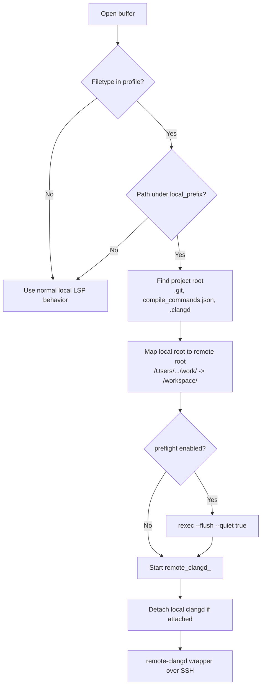
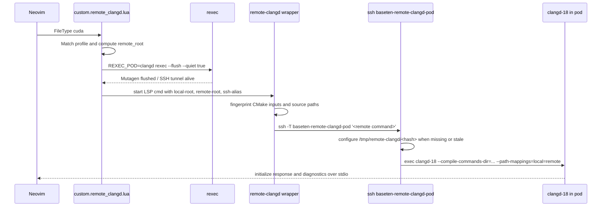
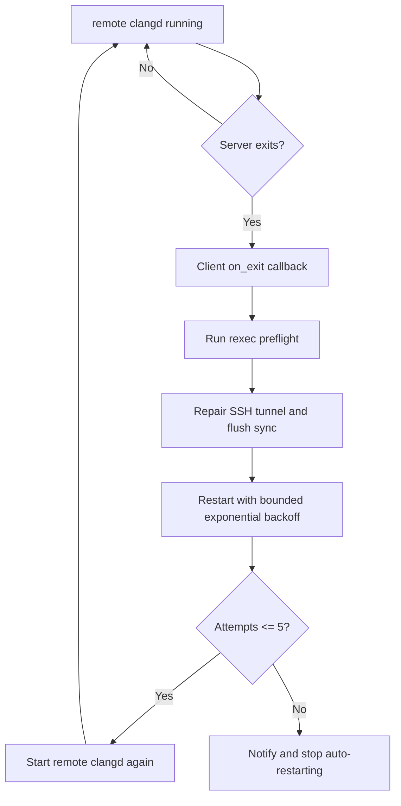

# Remote clangd for CUDA

This documents the personal Neovim workflow for editing CUDA locally while
receiving diagnostics from a dedicated CPU-only Kubernetes tooling pod.

The problem this solves: local macOS `clangd` cannot accurately impersonate the
remote NVIDIA CUDA/B200 environment. For example, local `clangd` falls back to
`sm_52` and reports setup errors such as `Cannot find CUDA installation` and
`Cannot find libdevice`. Instead, Neovim starts `clangd-18` in a pod built from
the pinned TRT-LLM CUDA 13.1 image and maps local paths to remote paths.

## Components

| Component | Location | Purpose |
| --- | --- | --- |
| Neovim module | `~/.config/nvim/lua/custom/remote_clangd.lua` | Detects matching C/C++/CUDA buffers, blocks local `clangd`, starts remote clangd. |
| Project profiles | `~/.config/nvim/lua/custom/remote_clangd_projects.lua` | Private local-to-remote mapping, toolchain, and compilation database config. |
| Stdio bridge | `~/.local/bin/remote-clangd` | Starts remote `clangd` over SSH with path mappings and either a project or fallback compilation database. Source: `~/dotfiles/bin/remote-clangd`. |
| Headless checker | `~/.local/bin/check-remote-clangd-nvim` | Tests real Neovim config and remote diagnostics. Source: `~/dotfiles/bin/check-remote-clangd-nvim`. |
| SSH/sync substrate | `rexec`, `~/.config/rexec/pods.yaml`, `.rexec.yaml` | Keeps the pod SSH shim, port-forward, and Mutagen sync alive. |
| Kubernetes manifest | `~/dotfiles/kubernetes/remote-clangd-statefulset.yaml` | Runs the CPU-only Vultr pod with the pinned TRT-LLM image and Clang 18. |

The Neovim config is managed separately from this dotfiles repo at
`~/.config/nvim` / `dukebw/kickstart.nvim`. This document records the workflow
and operational model in dotfiles because it depends on `rexec`, SSH, and the
Vultr tooling pod.

`~/dotfiles/install.sh` symlinks the dotfiles copies of `remote-clangd` and
`check-remote-clangd-nvim` into `~/.local/bin`.

## High-Level Flow

```mermaid
flowchart LR
  subgraph local[Local MacBook]
    nvim[Neovim buffer\n/Users/brendanduke/work/<repo>/*.cu]
    module[custom.remote_clangd.lua]
    bridge[~/.local/bin/remote-clangd]
    rexec[rexec / Mutagen / SSH alias]
  end

  subgraph pod[CPU-only Kubernetes tooling pod]
    workdir[/workspace/<repo>]
    cdb[/tmp/remote-clangd/<hash>/compile_commands.json]
    clangd[clangd-18\n--cuda-gpu-arch=sm_100a]
    cuda[/usr/local/cuda]
  end

  nvim --> module
  module -->|CUDA buffer matches profile| bridge
  bridge -->|ssh baseten-remote-clangd-pod| clangd
  rexec -->|flushes local edits| workdir
  bridge -->|configures or generates CDB| cdb
  clangd --> cdb
  clangd --> cuda
  clangd -->|LSP diagnostics over stdio| nvim
```

## Buffer Matching Logic

The generic Neovim logic is intentionally not tied to a single repo.



Abbreviated TRT-LLM-specific profile shape:

```lua
return {
  {
    name = 'trt_llm',
    local_prefix = os.getenv('HOME') .. '/work',
    root_name_pattern = '^trt%-llm',
    remote_prefix = '/workspace',
    rexec_pod = 'clangd',
    ssh_alias = 'baseten-remote-clangd-pod',
    clangd = 'clangd-18',
    compiler = 'clang++-18',
    cuda_arch = 'sm_100a',
    cuda_path = '/usr/local/cuda',
    cmake = {
      source_dir = 'cpp',
      environment = { OPAL_PREFIX = '/opt/hpcx/ompi' },
      args = {
        '-G', 'Ninja',
        '-DCMAKE_CUDA_COMPILER=/usr/local/cuda/bin/nvcc',
        '-DCMAKE_CUDA_ARCHITECTURES=100-real',
        '-DMPI_C_COMPILER=/opt/hpcx/ompi/bin/mpicc',
        '-DMPI_CXX_COMPILER=/opt/hpcx/ompi/bin/mpicxx',
        '-DPython3_EXECUTABLE=/usr/bin/python3',
        '-DTensorRT_ROOT=/usr/local/tensorrt',
        '-DTRTLLM_FETCHCONTENT_CACHE=/tmp/remote-clangd/fetchcontent-cache',
        '-DBUILD_PYT=ON',
      },
    },
    filetypes = { 'c', 'cpp', 'cuda' },
    preflight = true,
  },
}
```

The TRT-LLM profile handles C, C++, and CUDA in roots whose name starts with
`trt-llm`. A lower-priority profile handles CUDA in other repositories under
`~/work`; a local path such as:

```text
~/work/<repo>
```

is diagnosed using the matching remote path:

```text
/workspace/<repo>
```

## Setting Up A New Repo

For a new local repo at `~/work/new-repo`, the generic CUDA profile already
matches the path. The required setup is to create or refresh the matching remote
workdir; the dedicated pod installs Clang 18 during startup.

From the new repo root:

```bash
cd ~/work/new-repo
REXEC_POD=clangd REXEC_LOCAL_ROOT="$PWD" REXEC_WORKDIR="/workspace/new-repo" rexec --setup
```

When no `.rexec.yaml` exists, the paired root variables form an ephemeral
worktree config and bypass `~/.config/rexec/config.yaml`. Remote clangd uses the
same path during preflight, so a new matching checkout does not depend on a
global fallback. A local `.rexec.yaml` is still preferred for persistent ignore
rules and normal `r`/`rexec` use.

Check the remote clangd toolchain:

```bash
rexec -p clangd --shell 'command -v clangd-18 && command -v clang++-18'
```

The StatefulSet installs `clangd-18` during pod startup. Reapply its manifest if
either binary is missing.

Then open a CUDA file locally:

```bash
nvim ~/work/new-repo/path/to/file.cu
```

In Neovim, `:LspInfo` should show:

```text
remote_clangd_b200
```

TRT-LLM roots use `remote_clangd_trt_llm` instead.

It should not show local `clangd` for that CUDA buffer.

Optional headless check:

```bash
check-remote-clangd-nvim ~/work/new-repo/path/to/file.cu
```

For a project that intentionally enables broad clang-tidy checks, keep reporting
diagnostics while validating attachment and toolchain resolution:

```bash
check-remote-clangd-nvim --allow-diagnostics ~/work/new-repo/path/to/file.cpp
```

## LSP Startup Sequence



The wrapper is a pure stdio bridge once it starts. It must not print normal log
messages to stdout, because stdout is the LSP JSON stream.

## Remote Compile Database

The workflow does not write `compile_commands.json` or build artifacts into
synced repositories. A project with a `cmake` profile gets a build directory
keyed by its full remote root:

```text
/tmp/remote-clangd/<hash>/compile_commands.json
```

Before connecting, the bridge fingerprints the configure command, all
`CMakeLists.txt` and `*.cmake` contents, and the set of C/C++/CUDA source paths.
It acquires a per-build remote lock and reruns CMake when that fingerprint
changes or the database is absent. Editing source contents does not trigger a
configure; adding or removing a source or changing CMake does. Separate
worktrees have separate hashes and configure once each. TRT-LLM FetchContent
repositories share `/tmp/remote-clangd/fetchcontent-cache` to reduce subsequent
worktree setup time.

Projects may instead set `compile_commands_dir` to use an existing database. A
container profile must use this mode because CMake automation currently runs on
the SSH host. The worktree and database paths must be visible at the same
locations inside the container.

When no CMake profile or existing database is configured, `remote-clangd`
generates a generic fallback database in the same per-root scratch location.

Fallback generation covers C, C++, CUDA, and header extensions. CUDA entries
get a parse command like:

```text
clang++-18
-x cuda
--cuda-path=/usr/local/cuda
--no-cuda-version-check
--cuda-gpu-arch=sm_100a
-I/usr/local/cuda/include
-std=c++17
-fPIC
-c <file>
```

Fallback commands include the project, `cpp`, `cpp/include`, Cutlass, CUDA, and
TensorRT include roots. They are editor bootstrapping metadata, not an
authoritative build configuration; projects should still generate their real
compilation database when exact flags matter.

## Reconnect And Failure Behavior

Remote clangd is restarted by Neovim, not by a shell loop.



Why restart in Neovim instead of the shell wrapper: a new `clangd` process needs
a fresh LSP `initialize` handshake. If a shell loop restarts `clangd` behind the
same stdio pipe, Neovim will send normal in-session messages to an uninitialized
server.

Expected failure cases:

- Pod moved or restarted.
- `kubectl port-forward` died.
- SSH alias points at a stale tunnel.
- Selected pod or tooling container is missing the configured clangd/compiler.
- Mutagen sync is stale.

Recovery after moving pods:

```bash
rexec --setup -p clangd
REXEC_POD=clangd REXEC_LOCAL_ROOT=~/work/<repo> REXEC_WORKDIR=/workspace/<repo> rexec --flush --quiet true
```

If the pod is missing or its image changed, reapply the checked-in manifest:

```bash
KUBECONFIG=~/.rcli/kubeconfig/rancher/vultr-us-sea-prod-1.yaml \
  kubectl apply -f ~/dotfiles/kubernetes/remote-clangd-statefulset.yaml
```

## Verification

Use the personal checker against any local CUDA file under `~/work`:

```bash
check-remote-clangd-nvim ~/work/Wan2.2-b10/wan/kernels/vsa_cuda/vsa_39.cu
```

Expected clean output:

```text
attached clients: remote_clangd_b200
mode: clean
diagnostics: 0
```

Verify diagnostics are genuinely coming from the remote server with an unsaved
injected error:

```bash
check-remote-clangd-nvim --inject ~/work/Wan2.2-b10/wan/kernels/vsa_cuda/vsa_39.cu
```

Exercise automatic recovery by terminating the active port-forward during the
check:

```bash
check-remote-clangd-nvim --allow-diagnostics --probe-tunnel-recovery ~/work/<repo>/path/to/file.cpp
```

Expected injected output:

```text
attached clients: remote_clangd_b200
mode: injected
diagnostics: 1
1116:3 Use of undeclared identifier 'definitely_not_declared_for_remote_clangd_probe'
```

In interactive Neovim, inspect clients for the current buffer with:

```vim
:lua vim.print(vim.tbl_map(function(c) return c.name end, vim.lsp.get_clients({ bufnr = 0 })))
```

For a matched CUDA buffer this should show:

```text
remote_clangd_b200
```

It should not show local `clangd` for that buffer. If diagnostics mention
`sm_52`, `Cannot find CUDA installation`, or `Cannot find libdevice`, local
clangd is still attached or the remote path failed before startup.

## Current Tradeoffs

- The generic fallback is editor bootstrapping metadata, not an authoritative
  build configuration. The TRT-LLM profile uses a real CMake database instead.
- First attachment to a new TRT-LLM worktree waits for CMake configuration;
  later attachments reuse it until the configure fingerprint changes.
- The per-worktree database and shared dependency cache are pod-local scratch.
  A pod recreation clears them and the next attachment configures them again.
- The dedicated pod requests no GPU. Its CUDA 13.1 and TensorRT headers come
  from the pinned TRT-LLM release image.
- `/workspace` is ephemeral. Mutagen repopulates it from the authoritative local
  checkout after pod recreation.
- Each profile assumes its configured clangd/compiler is available on the pod
  or in its tooling container.
- The local Mac remains the source of truth for editing and Git. The pod is
  disposable compute and editor tooling.
- Long-lived credentials stay local. The pod sees synced source and a temporary
  SSH public key only, following the `rexec` security model.
